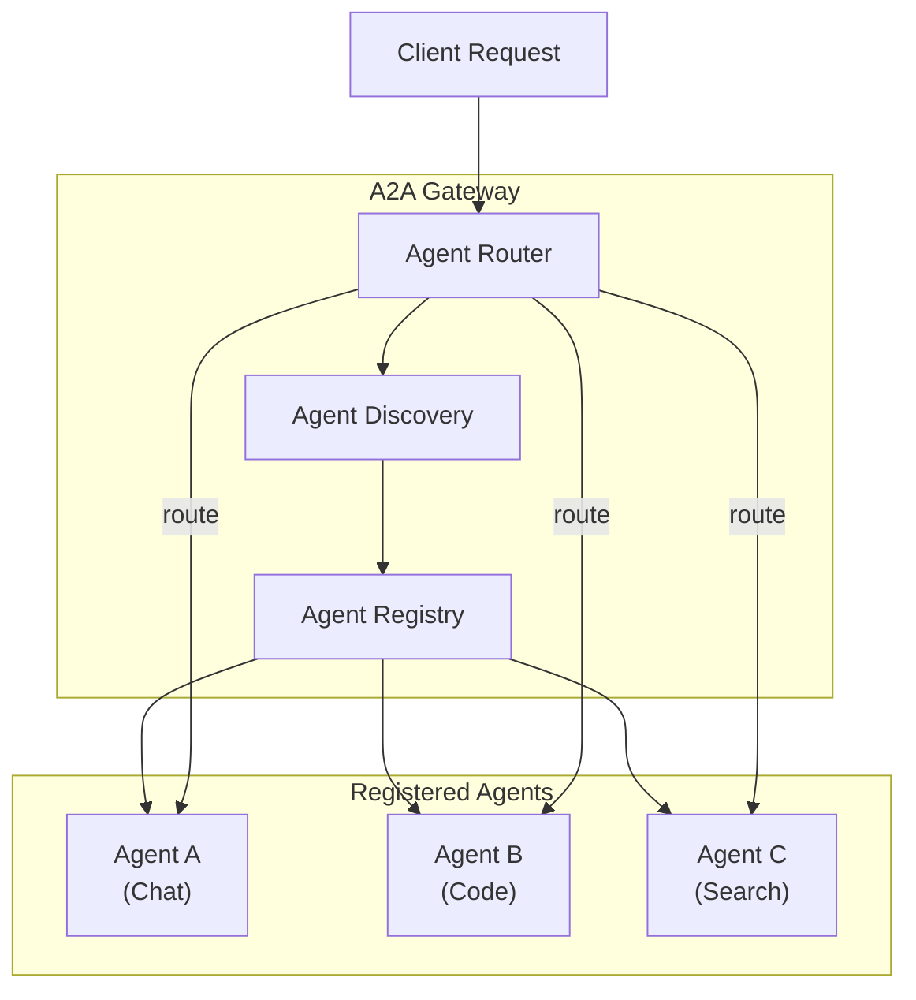

# A2A Gateway - Agent-to-Agent Protocol

> **Attribution**:
> RouteIQ is built on top of upstream [LiteLLM](https://github.com/BerriAI/litellm) for proxy/API compatibility and [LLMRouter](https://github.com/ulab-uiuc/LLMRouter) for ML routing.

**RouteIQ Gateway** implements the A2A (Agent-to-Agent) protocol, enabling standardized communication and orchestration between AI agents.

## Overview

The A2A Gateway facilitates the discovery and communication of AI agents using Google's [A2A protocol](https://google.github.io/A2A/). This allows you to:

- Register AI agents with their capabilities
- Discover agents based on capabilities
- Route requests to appropriate agents
- Build multi-agent systems with agent orchestration

## Enabling A2A Gateway

Set the environment variable:

```bash
A2A_GATEWAY_ENABLED=true
```

Or in docker-compose:

```yaml
environment:
  - A2A_GATEWAY_ENABLED=true
```

## API Endpoints

### Invoke an Agent (Canonical)

The primary endpoint for invoking an A2A agent using JSON-RPC:

```bash
POST /a2a/{agent_id}
Authorization: Bearer <master_key>
Content-Type: application/json

{
  "jsonrpc": "2.0",
  "method": "message/send",
  "id": "1",
  "params": {
    "message": {
      "role": "user",
      "content": "Hello, agent!"
    }
  }
}
```

This endpoint supports both synchronous responses and Server-Sent Events (SSE) streaming based on the `Accept` header.

### Invoke an Agent (Streaming Alias)

An explicit streaming alias endpoint that proxies to the canonical endpoint:

```bash
POST /a2a/{agent_id}/message/stream
Authorization: Bearer <master_key>
Content-Type: application/json
Accept: text/event-stream

{
  "jsonrpc": "2.0",
  "method": "message/send",
  "id": "1",
  "params": {
    "message": {
      "role": "user",
      "content": "Hello, agent!"
    }
  }
}
```

This is useful when you need an explicit streaming URL for load balancers or client frameworks that route based on URL patterns.

### Get Agent Card

Retrieve the A2A agent card for discovery:

```bash
GET /a2a/{agent_id}/.well-known/agent-card.json
```

The returned URL in the agent card will include the load balancer port (e.g., `:8080`) when accessed through nginx.

### Register an Agent

```bash
POST /a2a/agents
Authorization: Bearer <master_key>
Content-Type: application/json

{
  "agent_id": "my-agent",
  "name": "My AI Agent",
  "description": "An agent that handles customer support",
  "url": "http://agent-service:8000/a2a",
  "capabilities": ["chat", "support", "ticket-creation"],
  "metadata": {
    "version": "1.0.0",
    "owner": "support-team"
  }
}
```

### List All Agents

```bash
GET /a2a/agents
Authorization: Bearer <master_key>
```

Response:
```json
{
  "agents": [
    {
      "agent_id": "my-agent",
      "name": "My AI Agent",
      "description": "An agent that handles customer support",
      "url": "http://agent-service:8000/a2a",
      "capabilities": ["chat", "support", "ticket-creation"]
    }
  ]
}
```

### Discover Agents by Capability

```bash
GET /a2a/agents?capability=chat
Authorization: Bearer <master_key>
```

### Get Agent Card (A2A Protocol)

```bash
GET /a2a/agents/{agent_id}/card
```

Returns the A2A agent card in the standard format.

### Unregister an Agent

```bash
DELETE /a2a/agents/{agent_id}
Authorization: Bearer <master_key>
```

## Python SDK Usage

```python
from litellm_llmrouter import get_a2a_gateway, A2AAgent

# Get gateway instance
gateway = get_a2a_gateway()

# Register an agent
agent = A2AAgent(
    agent_id="code-agent",
    name="Code Assistant",
    description="Helps with code review and generation",
    url="http://localhost:9000/a2a",
    capabilities=["code", "review", "generation"]
)
gateway.register_agent(agent)

# Discover agents
code_agents = gateway.discover_agents("code")
for agent in code_agents:
    print(f"Found agent: {agent.name}")

# Get agent card
card = gateway.get_agent_card("code-agent")
print(card)
```

## Multi-Agent Architecture



## Configuration Options

| Environment Variable | Default | Description |
|---------------------|---------|-------------|
| `A2A_GATEWAY_ENABLED` | `false` | Enable A2A gateway |
| `STORE_MODEL_IN_DB` | `false` | Persist agents in database |

## See Also

- [MCP Gateway](mcp-gateway.md) - Model Context Protocol support
- [Hot Reloading](hot-reloading.md) - Dynamic configuration updates
- [API Reference](api-reference.md) - Complete API documentation
