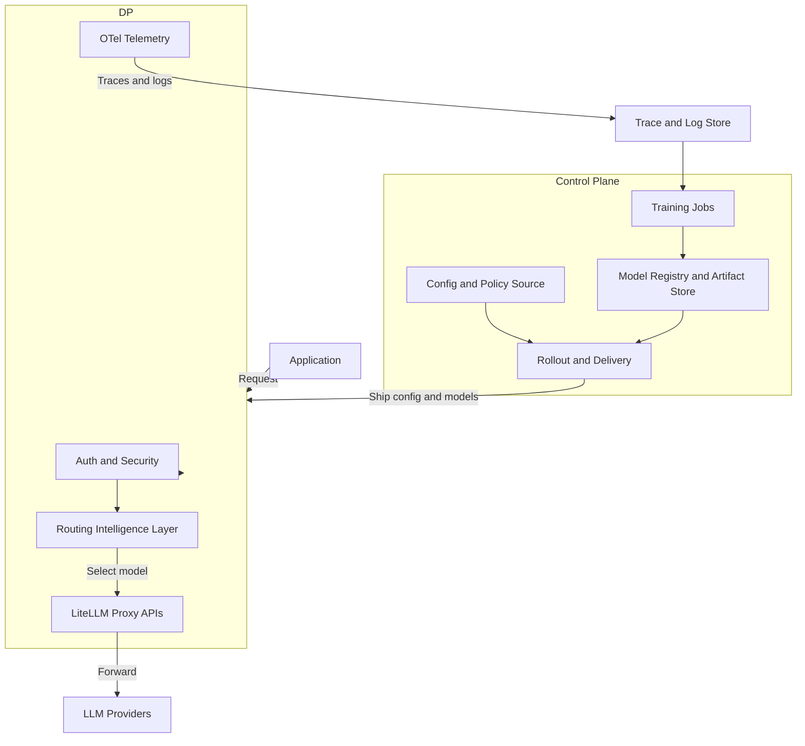

# RouteIQ Gateway Architecture

> **Attribution**:
> RouteIQ is built on top of upstream [LiteLLM](https://github.com/BerriAI/litellm) for proxy/API compatibility and [LLMRouter](https://github.com/ulab-uiuc/LLMRouter) for ML routing.

**RouteIQ Gateway** is designed as a high-performance, cloud-native AI Gateway that sits between your applications and LLM providers.

## High-Level Overview

RouteIQ is organized as two logical planes:

1.  **Data Plane (Gateway Runtime)**: The in-path serving component that receives API traffic and forwards it to LLM providers.
2.  **Control Plane (Management + Delivery)**: The out-of-path systems that configure the gateway and deliver routing models/configuration.

Within the **Data Plane**, a **Routing Intelligence Layer** executes routing decisions for each request using pluggable strategies.

A closed-loop MLOps workflow connects the planes: **telemetry → train → registry → rollout**.

## Component Diagram

## Key Components

### 1. Data Plane: LiteLLM Proxy + RouteIQ Extensions

Built on top of LiteLLM, the data plane provides:

- **Unified API**: OpenAI-compatible proxy surface (largely inherited from upstream LiteLLM).
- **Protocol Translation**: Converts requests for Bedrock, Vertex, etc.
- **Gateway Surfaces**: MCP, A2A, Skills, and OpenAI-compatible vector store endpoints.
  - **Note**: External VectorDB integrations (Pinecone, Weaviate, etc.) are not implemented in this repository yet.

### 2. Routing Intelligence Layer (in the Data Plane)

The routing layer is the decision engine that runs inline with serving traffic. It supports:

- **Static Strategies**: round-robin, fallback, etc. (LiteLLM-native)
- **ML Strategies**: `llmrouter-*` strategies that load a trained model artifact for inference-time selection
- **Pluggability**: custom strategies can be added as Python modules and enabled via configuration
- **Artifact Safety**: loading pickle-based sklearn models is disabled by default and requires explicit opt-in (`LLMROUTER_ALLOW_PICKLE_MODELS=true`).

### 3. Control Plane (Configuration + Model Delivery)

The control plane is intentionally decoupled from request serving. Typical responsibilities include:

- **Configuration Management**: declare model lists, policies, and routing strategy settings.
- **Artifact Registry**: store trained routing artifacts (e.g., S3/MinIO or MLflow-managed storage).
- **Rollout Delivery**: distribute new config/models to the data plane via rolling deploys, mounted volumes, or sync sidecars.

### 4. Closed-Loop MLOps (Telemetry → Train → Registry → Rollout)

A continuous improvement loop:

- **Collect**: OTel traces/logs and outcome signals are emitted by the data plane.
- **Train**: offline jobs produce new routing artifacts.
- **Deploy**: new artifacts are rolled out to the data plane; the routing layer reloads when local artifacts change.
