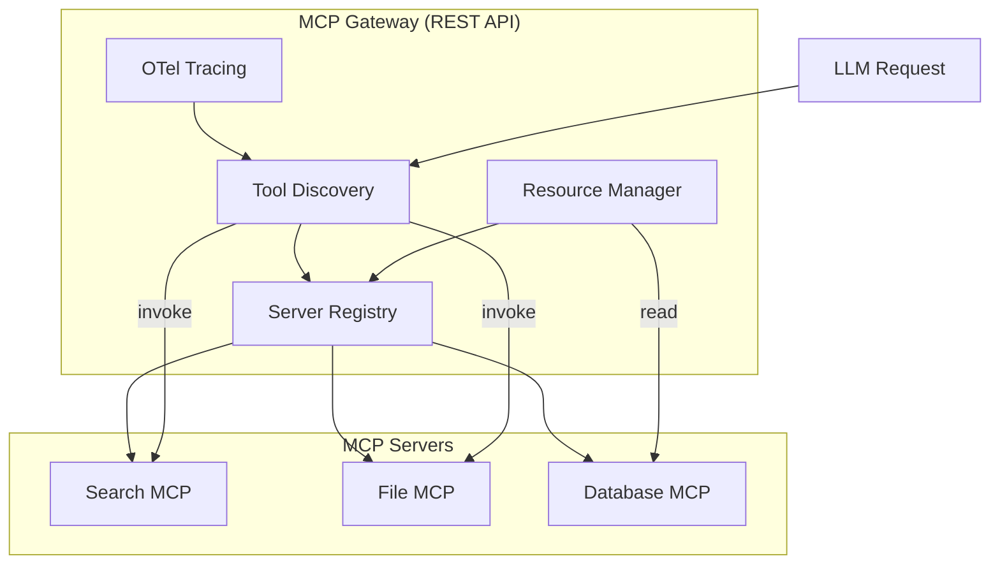

# MCP Gateway - Model Context Protocol

> **Attribution**:
> RouteIQ is built on top of upstream [LiteLLM](https://github.com/BerriAI/litellm) for proxy/API compatibility and [LLMRouter](https://github.com/ulab-uiuc/LLMRouter) for ML routing.

**RouteIQ Gateway** includes a fully integrated MCP (Model Context Protocol) Gateway, allowing you to bridge MCP servers to LLMs and expose tools and resources securely.

This guide covers the MCP (Model Context Protocol) gateway functionality for extending LLMs with external tools and data sources.

## Overview

The MCP Gateway acts as a centralized hub for Model Context Protocol interactions. It allows LLMs to:

- Access external tools (search, file operations, APIs)
- Query data sources and databases
- Interact with custom services
- Use resources from MCP servers

## Protocol Clarification

**Important:** This gateway provides two interfaces:

| Path | Protocol | Description |
|------|----------|-------------|
| `/llmrouter/mcp/*` | **REST API** | LLMRouter's management endpoints for server registration, tool listing, and tool invocation. Use standard JSON payloads. |
| `/mcp` (LiteLLM native) | **MCP Protocol (JSON-RPC/SSE)** | LiteLLM's native MCP mount uses JSON-RPC 2.0 over SSE. Not documented here. |

This document covers the **REST API** endpoints provided by LLMRouter at `/llmrouter/mcp/*`.

> **Note on Anthropic Skills:**
> If you are looking for Anthropic's "Computer Use" or "Bash" skills, those are distinct from MCP. See the [Skills Gateway Guide](skills-gateway.md) for details. We support both protocols.

## Enabling MCP Gateway

Set the environment variable:

```bash
MCP_GATEWAY_ENABLED=true
```

Or in docker-compose:

```yaml
environment:
  - MCP_GATEWAY_ENABLED=true
```

## REST API Endpoints

All endpoints below use standard REST conventions with JSON request/response bodies.

### Register an MCP Server

```bash
curl -X POST http://localhost:8080/llmrouter/mcp/servers \
  -H "Authorization: Bearer <master_key>" \
  -H "Content-Type: application/json" \
  -d '{
    "server_id": "my-mcp-server",
    "name": "My MCP Server",
    "url": "http://mcp-service:8080/mcp",
    "transport": "streamable_http",
    "tools": ["search", "fetch", "write"],
    "resources": ["documents", "images"],
    "auth_type": "bearer_token",
    "metadata": {
      "version": "1.0.0"
    }
  }'
```

**Response (200 OK):**
```json
{
  "status": "registered",
  "server_id": "my-mcp-server"
}
```

### Transport Types

| Transport | Description | Use Case |
|-----------|-------------|----------|
| `streamable_http` | HTTP with streaming | Most common, production use |
| `sse` | Server-Sent Events | Real-time updates |
| `stdio` | Standard I/O | Local development |

### List All MCP Servers

```bash
curl -X GET http://localhost:8080/llmrouter/mcp/servers \
  -H "Authorization: Bearer <master_key>"
```

**Response:**
```json
{
  "servers": [
    {
      "server_id": "my-mcp-server",
      "name": "My MCP Server",
      "url": "http://mcp-service:8080/mcp",
      "transport": "streamable_http",
      "tools": ["search", "fetch", "write"],
      "resources": ["documents", "images"]
    }
  ]
}
```

### Get Specific Server

```bash
curl -X GET http://localhost:8080/llmrouter/mcp/servers/{server_id} \
  -H "Authorization: Bearer <master_key>"
```

### List Available Tools

```bash
curl -X GET http://localhost:8080/llmrouter/mcp/tools \
  -H "Authorization: Bearer <master_key>"
```

**Response:**
```json
{
  "tools": [
    {
      "server_id": "my-mcp-server",
      "server_name": "My MCP Server",
      "tool": "search"
    }
  ]
}
```

### List Available Resources

```bash
curl -X GET http://localhost:8080/llmrouter/mcp/resources \
  -H "Authorization: Bearer <master_key>"
```

**Response:**
```json
{
  "resources": [
    {
      "server_id": "my-mcp-server",
      "server_name": "My MCP Server",
      "resource": "documents"
    }
  ]
}
```

### Call a Tool

**Note:** Remote tool invocation is **disabled by default** for security. When disabled, this endpoint returns HTTP 501 (Not Implemented).

To enable tool invocation, set `LLMROUTER_ENABLE_MCP_TOOL_INVOCATION=true` after configuring appropriate SSRF protections.

```bash
curl -X POST http://localhost:8080/llmrouter/mcp/tools/call \
  -H "Authorization: Bearer <master_key>" \
  -H "Content-Type: application/json" \
  -d '{
    "tool_name": "search",
    "arguments": {
      "query": "hello world"
    }
  }'
```

**Response (when enabled, 200 OK):**
```json
{
  "status": "success",
  "tool_name": "search",
  "server_id": "my-mcp-server",
  "result": {
    "data": "..."
  }
}
```

**Response (when disabled, 501 Not Implemented):**
```json
{
  "error": "tool_invocation_disabled",
  "message": "Remote tool invocation is disabled. Enable via LLMROUTER_ENABLE_MCP_TOOL_INVOCATION=true",
  "request_id": "abc123"
}
```

**Error Response (404 Not Found):**
```json
{
  "error": "tool_not_found",
  "message": "Tool 'unknown-tool' not found",
  "request_id": "abc123"
}
```

### Unregister an MCP Server

```bash
curl -X DELETE http://localhost:8080/llmrouter/mcp/servers/{server_id} \
  -H "Authorization: Bearer <master_key>"
```

**Response:**
```json
{
  "status": "unregistered",
  "server_id": "my-mcp-server"
}
```

### MCP Registry (Discovery)

Get a registry document for MCP server discovery:

```bash
curl -X GET http://localhost:8080/v1/llmrouter/mcp/registry.json \
  -H "Authorization: Bearer <master_key>"
```

**Response:**
```json
{
  "version": "1.0",
  "servers": [
    {
      "id": "my-mcp-server",
      "name": "My MCP Server",
      "url": "http://mcp-service:8080/mcp",
      "transport": "streamable_http",
      "tools": ["search"],
      "resources": ["documents"],
      "auth_type": "bearer_token"
    }
  ],
  "server_count": 1
}
```

### Server Health Check

```bash
curl -X GET http://localhost:8080/v1/llmrouter/mcp/server/health \
  -H "Authorization: Bearer <master_key>"
```

**Response:**
```json
{
  "servers": [
    {
      "server_id": "my-mcp-server",
      "name": "My MCP Server",
      "url": "http://mcp-service:8080/mcp",
      "status": "healthy",
      "latency_ms": 12,
      "transport": "streamable_http",
      "tool_count": 3,
      "resource_count": 2
    }
  ],
  "summary": {
    "total": 1,
    "healthy": 1,
    "unhealthy": 0
  }
}
```

## Python SDK Usage

```python
from litellm_llmrouter import get_mcp_gateway, MCPServer, MCPTransport

# Get gateway instance
gateway = get_mcp_gateway()

# Register an MCP server
server = MCPServer(
    server_id="search-server",
    name="Search Service",
    url="http://localhost:8080/mcp",
    transport=MCPTransport.STREAMABLE_HTTP,
    tools=["web_search", "image_search"],
    resources=["search_results"]
)
gateway.register_server(server)

# List all tools
tools = gateway.list_tools()
for tool in tools:
    print(f"Tool: {tool['tool']} from {tool['server_name']}")
```

## Configuration in YAML

```yaml
mcp_servers:
  search_server:
    url: "http://search-service:8080/mcp"
    transport: "streamable_http"
    tools: ["search"]

  file_server:
    url: "http://file-service:8081/mcp"
    transport: "streamable_http"
    tools: ["read_file", "write_file"]
    auth_type: "api_key"
```

## Architecture



## Configuration Options

| Environment Variable | Default | Description |
|---------------------|---------|-------------|
| `MCP_GATEWAY_ENABLED` | `false` | Enable MCP gateway REST endpoints |
| `LLMROUTER_ENABLE_MCP_TOOL_INVOCATION` | `false` | **Security-sensitive.** Enable remote HTTP calls to MCP servers for tool invocation. When `false`, `/llmrouter/mcp/tools/call` returns 501. |
| `MCP_TRACING_ENABLED` | `true` | Enable OTel tracing for MCP operations |
| `MCP_HA_SYNC_ENABLED` | `true` | Enable Redis-backed HA sync for MCP servers |
| `MCP_SYNC_INTERVAL` | `5` | Seconds between Redis sync checks |
| `STORE_MODEL_IN_DB` | `false` | Persist servers in database (HA mode) |

## Security: SSRF Protection

MCP server URLs are validated against SSRF attacks before registration and invocation.

**Default behavior (secure-by-default):**
- Private IPs (10.x, 172.16.x, 192.168.x) are **blocked**
- Loopback (127.0.0.1) and metadata endpoints (169.254.169.254) are **always blocked**

**To allow internal MCP servers**, configure allowlists:

```bash
# Allow specific internal hosts
LLMROUTER_SSRF_ALLOWLIST_HOSTS=mcp.internal,.trusted-corp.com

# Allow specific IP ranges (CIDR notation)
LLMROUTER_SSRF_ALLOWLIST_CIDRS=10.100.0.0/16
```

See [Security Guide](security.md#ssrf-protection) for full details.

## HA Sync (High Availability)

When running multiple RouteIQ Gateway replicas behind a load balancer, MCP server registrations
need to be shared across replicas. The MCP gateway supports Redis-backed synchronization:

### Enabling HA Sync

1. Set `MCP_HA_SYNC_ENABLED=true` (default)
2. Configure Redis via `REDIS_HOST` and `REDIS_PORT`
3. All replicas will automatically share MCP server registrations

### How It Works

- **On registration:** Server is saved to local cache AND Redis
- **On list/get:** Local cache is synced from Redis (rate-limited to `MCP_SYNC_INTERVAL`)
- **On unregistration:** Server is removed from local cache AND Redis

### Redis Keys

| Key Pattern | Description |
|-------------|-------------|
| `litellm:mcp:servers:{server_id}` | Serialized MCP server registration |
| `litellm:mcp:sync` | Pub/sub channel for sync notifications |

### Example docker-compose.ha.yml

```yaml
services:
  routeiq-gateway-1:
    environment:
      - MCP_GATEWAY_ENABLED=true
      - MCP_HA_SYNC_ENABLED=true
      - REDIS_HOST=redis
      - REDIS_PORT=6379

  routeiq-gateway-2:
    environment:
      - MCP_GATEWAY_ENABLED=true
      - MCP_HA_SYNC_ENABLED=true
      - REDIS_HOST=redis
      - REDIS_PORT=6379
```

## OTel Tracing

When `MCP_TRACING_ENABLED=true` and OTel is configured, the gateway emits spans for:

- **`mcp.tool.call/{tool_name}`** - Tool invocations with attributes:
  - `mcp.server.id` - Server ID
  - `mcp.server.name` - Server name
  - `mcp.tool.name` - Tool name
  - `mcp.transport` - Transport type
  - `mcp.success` - Success/failure boolean
  - `mcp.error` - Error message (if any)
  - `mcp.duration_ms` - Execution duration

- **`mcp.server.register/{server_id}`** - Server registrations

- **`mcp.server.health/{server_id}`** - Health checks

## Error Handling

All error responses use consistent JSON format:

```json
{
  "error": "error_code",
  "message": "Error message describing what went wrong",
  "request_id": "correlation-id"
}
```

Common HTTP status codes:
- `404` - Server/tool not found, or MCP gateway disabled
- `400` - Invalid request payload or tool invocation failed
- `500` - Internal server error
- `501` - Tool invocation disabled (set `LLMROUTER_ENABLE_MCP_TOOL_INVOCATION=true` to enable)

## LiteLLM API Parity (Upstream-Compatible Endpoints)

RouteIQ Gateway provides upstream-compatible endpoint aliases that match LiteLLM's native MCP API paths. This enables clients built for LiteLLM to work seamlessly with RouteIQ Gateway.

### Parity Endpoint Aliases

| Upstream LiteLLM Path | RouteIQ Alias | Description |
|----------------------|---------------|-------------|
| `GET /v1/mcp/server` | ✅ Supported | List all configured MCP servers |
| `POST /v1/mcp/server` | ✅ Supported | Add a new MCP server (admin) |
| `PUT /v1/mcp/server` | ✅ Supported | Update an MCP server (admin) |
| `GET /v1/mcp/server/{server_id}` | ✅ Supported | Get specific MCP server info |
| `DELETE /v1/mcp/server/{server_id}` | ✅ Supported | Delete an MCP server (admin) |
| `GET /v1/mcp/server/health` | ✅ Supported | Health check for MCP servers |
| `GET /v1/mcp/tools` | ✅ Supported | List all available MCP tools |
| `GET /v1/mcp/access_groups` | ✅ Supported | List MCP access groups |
| `GET /v1/mcp/registry.json` | ✅ Supported | MCP registry for discovery |
| `GET /mcp-rest/tools/list` | ✅ Supported | List tools with mcp_info |
| `POST /mcp-rest/tools/call` | ✅ Supported | Call MCP tool via REST |

### Example: Using Upstream-Compatible Path

```bash
# List all MCP servers (upstream-compatible)
curl -X GET http://localhost:8080/v1/mcp/server \
  -H "Authorization: Bearer <api_key>"

# Create MCP server (upstream-compatible)
curl -X POST http://localhost:8080/v1/mcp/server \
  -H "Authorization: Bearer <master_key>" \
  -H "Content-Type: application/json" \
  -d '{
    "server_name": "my-mcp-server",
    "alias": "mcp",
    "url": "https://mcp-service:8080/mcp",
    "transport": "streamable_http"
  }'
```

## OAuth Support (Feature-Flagged)

RouteIQ Gateway supports OAuth2 authentication for MCP servers that require it. OAuth endpoints are **disabled by default** for security.

### Enabling OAuth Support

```bash
export MCP_OAUTH_ENABLED=true
```

### OAuth Endpoints

When `MCP_OAUTH_ENABLED=true`, these endpoints are available:

| Endpoint | Description |
|----------|-------------|
| `POST /v1/mcp/server/oauth/session` | Create temporary OAuth session (~5 min TTL) |
| `GET /v1/mcp/server/oauth/{server_id}/authorize` | OAuth authorization redirect |
| `POST /v1/mcp/server/oauth/{server_id}/token` | OAuth token exchange |
| `POST /v1/mcp/server/oauth/{server_id}/register` | OAuth dynamic client registration |
| `GET /mcp/oauth/callback` | OAuth callback (validates state for CSRF) |

### OAuth Flow Example

```bash
# 1. Create temporary session for OAuth server
curl -X POST http://localhost:8080/v1/mcp/server/oauth/session \
  -H "Authorization: Bearer <master_key>" \
  -H "Content-Type: application/json" \
  -d '{
    "server_name": "oauth-mcp-server",
    "url": "https://oauth-mcp.example.com",
    "auth_type": "oauth2",
    "authorization_url": "https://auth.example.com/authorize",
    "token_url": "https://auth.example.com/token"
  }'

# 2. Redirect user to authorization endpoint
# GET /v1/mcp/server/oauth/{server_id}/authorize?client_id=...&redirect_uri=...

# 3. After callback, exchange code for tokens
# POST /v1/mcp/server/oauth/{server_id}/token
```

### OAuth Security

- **State validation**: All OAuth callbacks validate the `state` parameter for CSRF protection
- **SSRF protection**: Authorization and token URLs are validated against SSRF policies
- **Short-lived sessions**: OAuth sessions expire after 5 minutes

## MCP Protocol Proxy (Feature-Flagged)

The MCP Protocol Proxy allows RouteIQ Gateway to forward MCP protocol requests (SSE/streamable HTTP) to registered MCP servers. This is **disabled by default** for security.

### Enabling Protocol Proxy

```bash
export MCP_PROTOCOL_PROXY_ENABLED=true
```

### Protocol Proxy Endpoint

When enabled, the gateway exposes:

```
/mcp/{server_id}/*
```

Requests are proxied to the registered MCP server's URL with:
- **SSRF protection**: Target URLs are validated against allow/deny policies
- **Strict timeouts**: Connect (10s), read (120s) timeouts enforced
- **Admin authentication**: Proxy requires admin API key

### Example

```bash
# Proxy SSE request to MCP server
curl -X POST http://localhost:8080/mcp/my-mcp-server/tools/call \
  -H "Authorization: Bearer <master_key>" \
  -H "Content-Type: application/json" \
  -H "Accept: text/event-stream" \
  -d '{"tool_name": "search", "arguments": {"query": "hello"}}'
```

### Protocol Proxy Configuration

| Environment Variable | Default | Description |
|---------------------|---------|-------------|
| `MCP_PROTOCOL_PROXY_ENABLED` | `false` | Enable protocol proxy |
| `MCP_PROXY_CONNECT_TIMEOUT` | `10` | Connect timeout (seconds) |
| `MCP_PROXY_READ_TIMEOUT` | `120` | Read timeout (seconds) |

## See Also

- [A2A Gateway](a2a-gateway.md) - Agent-to-Agent protocol support
- [Vector Stores](vector-stores.md) - Vector database integrations
- [API Reference](api-reference.md) - Complete API documentation
- [Observability](observability.md) - OTel tracing configuration
