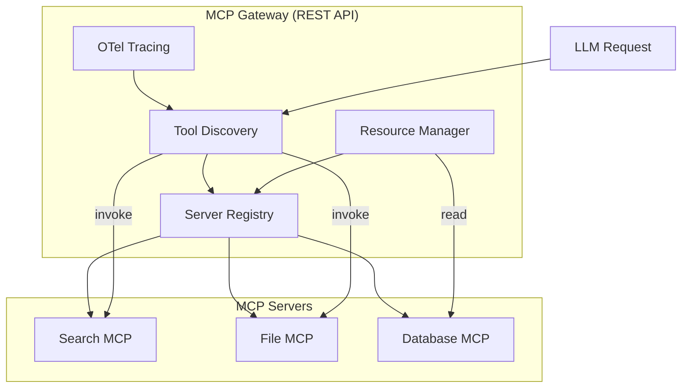

# MCP Gateway - Model Context Protocol

This guide covers the MCP (Model Context Protocol) gateway functionality for extending LLMs with external tools and data sources.

## Overview

The MCP Gateway enables integration with [Model Context Protocol](https://modelcontextprotocol.io/) servers, allowing LLMs to:

- Access external tools (search, file operations, APIs)
- Query data sources and databases
- Interact with custom services
- Use resources from MCP servers

## Protocol Clarification

**Important:** This gateway provides two interfaces:

| Path | Protocol | Description |
|------|----------|-------------|
| `/llmrouter/mcp/*` | **REST API** | LLMRouter's management endpoints for server registration, tool listing, and tool invocation. Use standard JSON payloads. |
| `/mcp` (LiteLLM native) | **MCP Protocol (JSON-RPC/SSE)** | LiteLLM's native MCP mount uses JSON-RPC 2.0 over SSE. Not documented here. |

This document covers the **REST API** endpoints provided by LLMRouter at `/llmrouter/mcp/*`.

> **Note on Anthropic Skills:**
> If you are looking for Anthropic's "Computer Use" or "Bash" skills, those are distinct from MCP. See the [Skills Gateway Guide](skills-gateway.md) for details. We support both protocols.

## Enabling MCP Gateway

Set the environment variable:

```bash
MCP_GATEWAY_ENABLED=true
```

Or in docker-compose:

```yaml
environment:
  - MCP_GATEWAY_ENABLED=true
```

## REST API Endpoints

All endpoints below use standard REST conventions with JSON request/response bodies.

### Register an MCP Server

```bash
curl -X POST http://localhost:8080/llmrouter/mcp/servers \
  -H "Authorization: Bearer <master_key>" \
  -H "Content-Type: application/json" \
  -d '{
    "server_id": "my-mcp-server",
    "name": "My MCP Server",
    "url": "http://mcp-service:8080/mcp",
    "transport": "streamable_http",
    "tools": ["search", "fetch", "write"],
    "resources": ["documents", "images"],
    "auth_type": "bearer_token",
    "metadata": {
      "version": "1.0.0"
    }
  }'
```

**Response (200 OK):**
```json
{
  "status": "registered",
  "server_id": "my-mcp-server"
}
```

### Transport Types

| Transport | Description | Use Case |
|-----------|-------------|----------|
| `streamable_http` | HTTP with streaming | Most common, production use |
| `sse` | Server-Sent Events | Real-time updates |
| `stdio` | Standard I/O | Local development |

### List All MCP Servers

```bash
curl -X GET http://localhost:8080/llmrouter/mcp/servers \
  -H "Authorization: Bearer <master_key>"
```

**Response:**
```json
{
  "servers": [
    {
      "server_id": "my-mcp-server",
      "name": "My MCP Server",
      "url": "http://mcp-service:8080/mcp",
      "transport": "streamable_http",
      "tools": ["search", "fetch", "write"],
      "resources": ["documents", "images"]
    }
  ]
}
```

### Get Specific Server

```bash
curl -X GET http://localhost:8080/llmrouter/mcp/servers/{server_id} \
  -H "Authorization: Bearer <master_key>"
```

### List Available Tools

```bash
curl -X GET http://localhost:8080/llmrouter/mcp/tools \
  -H "Authorization: Bearer <master_key>"
```

**Response:**
```json
{
  "tools": [
    {
      "server_id": "my-mcp-server",
      "server_name": "My MCP Server",
      "tool": "search"
    }
  ]
}
```

### List Available Resources

```bash
curl -X GET http://localhost:8080/llmrouter/mcp/resources \
  -H "Authorization: Bearer <master_key>"
```

**Response:**
```json
{
  "resources": [
    {
      "server_id": "my-mcp-server",
      "server_name": "My MCP Server",
      "resource": "documents"
    }
  ]
}
```

### Call a Tool

```bash
curl -X POST http://localhost:8080/llmrouter/mcp/tools/call \
  -H "Authorization: Bearer <master_key>" \
  -H "Content-Type: application/json" \
  -d '{
    "tool_name": "search",
    "arguments": {
      "query": "hello world"
    }
  }'
```

**Response (200 OK):**
```json
{
  "status": "success",
  "tool_name": "search",
  "server_id": "my-mcp-server",
  "result": {
    "message": "Tool search invoked successfully"
  }
}
```

**Error Response (404 Not Found):**
```json
{
  "detail": "Tool 'unknown-tool' not found"
}
```

### Unregister an MCP Server

```bash
curl -X DELETE http://localhost:8080/llmrouter/mcp/servers/{server_id} \
  -H "Authorization: Bearer <master_key>"
```

**Response:**
```json
{
  "status": "unregistered",
  "server_id": "my-mcp-server"
}
```

### MCP Registry (Discovery)

Get a registry document for MCP server discovery:

```bash
curl -X GET http://localhost:8080/v1/llmrouter/mcp/registry.json \
  -H "Authorization: Bearer <master_key>"
```

**Response:**
```json
{
  "version": "1.0",
  "servers": [
    {
      "id": "my-mcp-server",
      "name": "My MCP Server",
      "url": "http://mcp-service:8080/mcp",
      "transport": "streamable_http",
      "tools": ["search"],
      "resources": ["documents"],
      "auth_type": "bearer_token"
    }
  ],
  "server_count": 1
}
```

### Server Health Check

```bash
curl -X GET http://localhost:8080/v1/llmrouter/mcp/server/health \
  -H "Authorization: Bearer <master_key>"
```

**Response:**
```json
{
  "servers": [
    {
      "server_id": "my-mcp-server",
      "name": "My MCP Server",
      "url": "http://mcp-service:8080/mcp",
      "status": "healthy",
      "latency_ms": 12,
      "transport": "streamable_http",
      "tool_count": 3,
      "resource_count": 2
    }
  ],
  "summary": {
    "total": 1,
    "healthy": 1,
    "unhealthy": 0
  }
}
```

## Python SDK Usage

```python
from litellm_llmrouter import get_mcp_gateway, MCPServer, MCPTransport

# Get gateway instance
gateway = get_mcp_gateway()

# Register an MCP server
server = MCPServer(
    server_id="search-server",
    name="Search Service",
    url="http://localhost:8080/mcp",
    transport=MCPTransport.STREAMABLE_HTTP,
    tools=["web_search", "image_search"],
    resources=["search_results"]
)
gateway.register_server(server)

# List all tools
tools = gateway.list_tools()
for tool in tools:
    print(f"Tool: {tool['tool']} from {tool['server_name']}")
```

## Configuration in YAML

```yaml
mcp_servers:
  search_server:
    url: "http://search-service:8080/mcp"
    transport: "streamable_http"
    tools: ["search"]

  file_server:
    url: "http://file-service:8081/mcp"
    transport: "streamable_http"
    tools: ["read_file", "write_file"]
    auth_type: "api_key"
```

## Architecture



## Configuration Options

| Environment Variable | Default | Description |
|---------------------|---------|-------------|
| `MCP_GATEWAY_ENABLED` | `false` | Enable MCP gateway REST endpoints |
| `MCP_TRACING_ENABLED` | `true` | Enable OTel tracing for MCP operations |
| `MCP_HA_SYNC_ENABLED` | `true` | Enable Redis-backed HA sync for MCP servers |
| `MCP_SYNC_INTERVAL` | `5` | Seconds between Redis sync checks |
| `STORE_MODEL_IN_DB` | `false` | Persist servers in database (HA mode) |

## HA Sync (High Availability)

When running multiple LiteLLM replicas behind a load balancer, MCP server registrations
need to be shared across replicas. The MCP gateway supports Redis-backed synchronization:

### Enabling HA Sync

1. Set `MCP_HA_SYNC_ENABLED=true` (default)
2. Configure Redis via `REDIS_HOST` and `REDIS_PORT`
3. All replicas will automatically share MCP server registrations

### How It Works

- **On registration:** Server is saved to local cache AND Redis
- **On list/get:** Local cache is synced from Redis (rate-limited to `MCP_SYNC_INTERVAL`)
- **On unregistration:** Server is removed from local cache AND Redis

### Redis Keys

| Key Pattern | Description |
|-------------|-------------|
| `litellm:mcp:servers:{server_id}` | Serialized MCP server registration |
| `litellm:mcp:sync` | Pub/sub channel for sync notifications |

### Example docker-compose.ha.yml

```yaml
services:
  litellm-gateway-1:
    environment:
      - MCP_GATEWAY_ENABLED=true
      - MCP_HA_SYNC_ENABLED=true
      - REDIS_HOST=redis
      - REDIS_PORT=6379

  litellm-gateway-2:
    environment:
      - MCP_GATEWAY_ENABLED=true
      - MCP_HA_SYNC_ENABLED=true
      - REDIS_HOST=redis
      - REDIS_PORT=6379
```

## OTel Tracing

When `MCP_TRACING_ENABLED=true` and OTel is configured, the gateway emits spans for:

- **`mcp.tool.call/{tool_name}`** - Tool invocations with attributes:
  - `mcp.server.id` - Server ID
  - `mcp.server.name` - Server name
  - `mcp.tool.name` - Tool name
  - `mcp.transport` - Transport type
  - `mcp.success` - Success/failure boolean
  - `mcp.error` - Error message (if any)
  - `mcp.duration_ms` - Execution duration

- **`mcp.server.register/{server_id}`** - Server registrations

- **`mcp.server.health/{server_id}`** - Health checks

## Error Handling

All error responses use consistent JSON format:

```json
{
  "detail": "Error message describing what went wrong"
}
```

Common HTTP status codes:
- `404` - Server/tool not found, or MCP gateway disabled
- `400` - Invalid request payload
- `500` - Internal server error

## See Also

- [A2A Gateway](a2a-gateway.md) - Agent-to-Agent protocol support
- [Vector Stores](vector-stores.md) - Vector database integrations
- [API Reference](api-reference.md) - Complete API documentation
- [Observability](observability.md) - OTel tracing configuration
