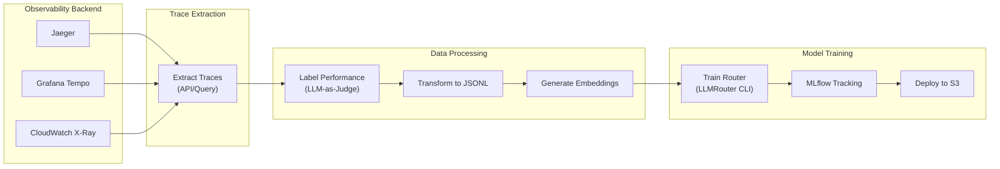

# MLOps Training Guide

This guide covers training, evaluating, and deploying custom LLMRouter routing models.

## Quick Start

```bash
cd examples/mlops
docker compose -f docker-compose.mlops.yml up -d
```

This starts:
- **MLflow** (port 5000) - Experiment tracking
- **MinIO** (port 9000/9001) - S3-compatible storage
- **Jupyter** (port 8888) - Interactive development
- **Trainer** - Training environment with GPU support

## Data Preparation & Telemetry

This section explains how to collect LLM request/response trace data from observability backends (Jaeger, Tempo, CloudWatch) and use it to train LLMRouter models.

### Overview

The training pipeline consists of three stages:



### Trace Data Requirements

LLMRouter training requires this data per request:

| Field | Description | Source |
|-------|-------------|--------|
| `query` | User's input prompt | Span attribute: `gen_ai.prompt` |
| `model_name` | Model that handled request | Span attribute: `gen_ai.response.model` |
| `performance` | Quality score (0.0-1.0) | Computed or labeled |
| `response_time` | Latency in seconds | Span duration |
| `token_num` | Total tokens used | Span: `gen_ai.usage.total_tokens` |

### Versioned Routing Telemetry Contract

Starting with RouteIQ v1.0, routing decisions emit a **versioned telemetry event** following the `routeiq.router_decision.v1` contract. This provides a stable, documented schema for MLOps pipelines.

#### Contract: `routeiq.router_decision.v1`

The routing decision event is emitted as an OpenTelemetry span event with a single JSON payload attribute.

**Event Name:** `routeiq.router_decision.v1`  
**Payload Key:** `routeiq.router_decision.payload`

#### Schema Definition

```json
{
  "contract_version": "v1",
  "contract_name": "routeiq.router_decision.v1",
  "event_id": "uuid-string",
  
  "trace_id": "32-hex-char-trace-id",
  "span_id": "16-hex-char-span-id",
  "parent_span_id": "16-hex-char-parent-id | null",
  
  "timestamp_utc": "2024-01-15T10:30:00.000Z",
  "timestamp_unix_ms": 1705315800000,
  
  "input": {
    "requested_model": "gpt-4 | null",
    "query_length": 150,
    "user_id": "hashed-user-id | null",
    "team_id": "team-id | null",
    "request_metadata": {}
  },
  
  "strategy_name": "llmrouter-knn",
  "strategy_version": "1.0.0 | null",
  
  "candidate_deployments": [
    {
      "model_name": "gpt-4",
      "provider": "openai",
      "score": 0.95,
      "available": true
    },
    {
      "model_name": "claude-3-opus",
      "provider": "anthropic",
      "score": 0.82,
      "available": true
    }
  ],
  
  "selected_deployment": "gpt-4",
  "selection_reason": "highest_score",
  
  "timings": {
    "total_ms": 15.5,
    "strategy_ms": 10.2,
    "embedding_ms": 3.1,
    "candidate_filter_ms": 2.2
  },
  
  "outcome": {
    "status": "success | failure | fallback | no_candidates | timeout | error",
    "error_message": "null | error description",
    "error_type": "null | ErrorClassName",
    "input_tokens": 100,
    "output_tokens": 200,
    "total_tokens": 300
  },
  
  "fallback": {
    "fallback_triggered": false,
    "original_model": "null | model-name",
    "fallback_reason": "null | rate_limit | error | timeout",
    "fallback_attempt": 0
  },
  
  "custom_attributes": {}
}
```

#### Field Descriptions

| Field | Type | Description |
|-------|------|-------------|
| `contract_version` | string | Schema version for compatibility checking |
| `contract_name` | string | Full contract identifier |
| `event_id` | string | Unique identifier for this event (UUID) |
| `trace_id` | string | OpenTelemetry trace ID (32 hex chars) |
| `span_id` | string | OpenTelemetry span ID (16 hex chars) |
| `input.query_length` | int | Character count of query (PII-safe, no content) |
| `strategy_name` | string | Routing strategy used (e.g., `llmrouter-knn`) |
| `candidate_deployments` | array | Models considered during routing |
| `selected_deployment` | string | Model that was selected |
| `timings.total_ms` | float | Total routing decision latency |
| `outcome.status` | enum | Final outcome of the routing decision |

#### PII Safety

The contract is designed to be **PII-safe**:
- **No query content** is logged - only `query_length`
- **No response content** is logged
- User/team IDs should be **hashed/anonymized** before logging

### Extracting Traces

#### From Jaeger

```python
#!/usr/bin/env python3
"""Extract LLM traces from Jaeger for router training."""
import json
import requests
from datetime import datetime, timedelta

JAEGER_URL = "http://localhost:16686"
SERVICE_NAME = "litellm"

def extract_jaeger_traces(hours_back: int = 24) -> list[dict]:
    """Extract LLM completion traces from Jaeger."""
    end_time = datetime.now()
    start_time = end_time - timedelta(hours=hours_back)

    # Query Jaeger API
    response = requests.get(
        f"{JAEGER_URL}/api/traces",
        params={
            "service": SERVICE_NAME,
            "operation": "litellm.completion",
            "start": int(start_time.timestamp() * 1_000_000),
            "end": int(end_time.timestamp() * 1_000_000),
            "limit": 10000,
        }
    )
    response.raise_for_status()

    traces = []
    for trace in response.json().get("data", []):
        for span in trace.get("spans", []):
            if span.get("operationName") == "litellm.completion":
                traces.append(extract_span_data(span))
    return traces

def extract_span_data(span: dict) -> dict:
    """Extract training-relevant data from a span."""
    tags = {t["key"]: t["value"] for t in span.get("tags", [])}
    duration_us = span.get("duration", 0)

    return {
        "query": tags.get("gen_ai.prompt", ""),
        "model_name": tags.get("gen_ai.response.model", ""),
        "response": tags.get("gen_ai.completion", ""),
        "response_time": duration_us / 1_000_000,  # Convert to seconds
        "token_num": int(tags.get("gen_ai.usage.total_tokens", 0)),
        "input_tokens": int(tags.get("gen_ai.usage.prompt_tokens", 0)),
        "output_tokens": int(tags.get("gen_ai.usage.completion_tokens", 0)),
        "task_name": "production",  # Default task
        "ground_truth": "",  # Needs labeling
        "metric": "custom",
        "performance": None,  # Needs labeling
    }
```

### Labeling Performance Data

Traces need `performance` scores (0.0-1.0) for training. Options:

#### Option 1: LLM-as-Judge

```python
import litellm

def label_with_llm(query: str, response: str) -> float:
    """Use an LLM to judge response quality."""
    judge_prompt = f"""Rate the quality of this response on a scale of 0-10.

Question: {query}
Response: {response}

Output only a number from 0-10."""

    result = litellm.completion(
        model="gpt-4o-mini",
        messages=[{"role": "user", "content": judge_prompt}],
    )
    score = int(result.choices[0].message.content.strip())
    return score / 10.0  # Normalize to 0-1
```

## Training a Router

### 1. Prepare Training Data

Create a dataset with query-model performance pairs:

```json
{
  "queries": [
    {"text": "Explain quantum computing", "best_model": "claude-3-opus"},
    {"text": "Write a hello world in Python", "best_model": "gpt-3.5-turbo"}
  ]
}
```

### 2. Configure Training

Create a YAML config:

```yaml
# configs/knn_config.yaml
data_path:
  train_data: /app/data/train.json
  llm_data: /app/data/llm_candidates.json

hparam:
  k: 5
  embedding_model: sentence-transformers/all-MiniLM-L6-v2
```

### 3. Run Training

```bash
docker compose exec llmrouter-trainer python /app/scripts/train_router.py \
  --router-type knn \
  --config /app/configs/knn_config.yaml
```

### 4. View Results in MLflow

Open http://localhost:5000 to see:
- Training metrics
- Model artifacts
- Experiment comparisons

## Deploying Models

### Register in MLflow

```python
import mlflow

mlflow.register_model(
    f"runs:/{run_id}/model",
    "knn-router-production"
)
```

### Deploy to Production

```bash
docker compose exec model-deployer python /app/scripts/deploy_model.py \
  --model-name knn-router-production \
  --model-stage Production \
  --s3-bucket my-models-bucket
```

### Update Gateway Config

```yaml
router_settings:
  routing_strategy: llmrouter-knn
  routing_strategy_args:
    model_s3_bucket: my-models-bucket
    model_s3_key: models/knn-router-production/
    hot_reload: true
```

## Training Different Router Types

### KNN Router
```bash
python train_router.py --router-type knn --config configs/knn.yaml
```

### MLP Router
```bash
python train_router.py --router-type mlp --config configs/mlp.yaml
```

### BERT Router
```bash
python train_router.py --router-type bert --config configs/bert.yaml
```

## Jupyter Notebooks

Access Jupyter at http://localhost:8888 (token: `llmrouter`)

Example notebooks:
- `01_data_exploration.ipynb` - Analyze routing data
- `02_train_knn_router.ipynb` - Train KNN router
- `03_evaluate_routers.ipynb` - Compare router performance

## CI/CD Integration

Add to your GitHub Actions:

```yaml
- name: Train Router
  run: |
    docker compose -f examples/mlops/docker-compose.mlops.yml run \
      llmrouter-trainer python /app/scripts/train_router.py \
      --router-type ${{ inputs.router_type }} \
      --config ${{ inputs.config }}

- name: Deploy Model
  if: github.ref == 'refs/heads/main'
  run: |
    docker compose run model-deployer python /app/scripts/deploy_model.py \
      --model-name ${{ inputs.model_name }} \
      --model-stage Production
```
