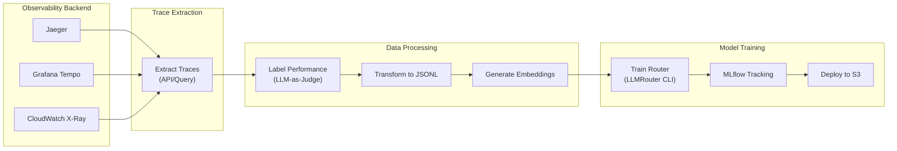

# Training Router Models from Observability Data

This guide explains how to collect LLM request/response trace data from observability backends (Jaeger, Tempo, CloudWatch) and use it to train LLMRouter models.

## Overview

The training pipeline consists of three stages:



## Prerequisites

- LiteLLM with OpenTelemetry enabled (see [Observability Guide](observability.md))
- Access to your tracing backend (Jaeger, Tempo, or CloudWatch)
- Python with `llmrouter` installed

## Trace Data Requirements

LLMRouter training requires this data per request:

| Field | Description | Source |
|-------|-------------|--------|
| `query` | User's input prompt | Span attribute: `gen_ai.prompt` |
| `model_name` | Model that handled request | Span attribute: `gen_ai.response.model` |
| `performance` | Quality score (0.0-1.0) | Computed or labeled |
| `response_time` | Latency in seconds | Span duration |
| `token_num` | Total tokens used | Span: `gen_ai.usage.total_tokens` |

## Extracting Traces

### From Jaeger

```python
#!/usr/bin/env python3
"""Extract LLM traces from Jaeger for router training."""
import json
import requests
from datetime import datetime, timedelta

JAEGER_URL = "http://localhost:16686"
SERVICE_NAME = "litellm"

def extract_jaeger_traces(hours_back: int = 24) -> list[dict]:
    """Extract LLM completion traces from Jaeger."""
    end_time = datetime.now()
    start_time = end_time - timedelta(hours=hours_back)

    # Query Jaeger API
    response = requests.get(
        f"{JAEGER_URL}/api/traces",
        params={
            "service": SERVICE_NAME,
            "operation": "litellm.completion",
            "start": int(start_time.timestamp() * 1_000_000),
            "end": int(end_time.timestamp() * 1_000_000),
            "limit": 10000,
        }
    )
    response.raise_for_status()

    traces = []
    for trace in response.json().get("data", []):
        for span in trace.get("spans", []):
            if span.get("operationName") == "litellm.completion":
                traces.append(extract_span_data(span))
    return traces

def extract_span_data(span: dict) -> dict:
    """Extract training-relevant data from a span."""
    tags = {t["key"]: t["value"] for t in span.get("tags", [])}
    duration_us = span.get("duration", 0)

    return {
        "query": tags.get("gen_ai.prompt", ""),
        "model_name": tags.get("gen_ai.response.model", ""),
        "response": tags.get("gen_ai.completion", ""),
        "response_time": duration_us / 1_000_000,  # Convert to seconds
        "token_num": int(tags.get("gen_ai.usage.total_tokens", 0)),
        "input_tokens": int(tags.get("gen_ai.usage.prompt_tokens", 0)),
        "output_tokens": int(tags.get("gen_ai.usage.completion_tokens", 0)),
        "task_name": "production",  # Default task
        "ground_truth": "",  # Needs labeling
        "metric": "custom",
        "performance": None,  # Needs labeling
    }

if __name__ == "__main__":
    traces = extract_jaeger_traces(hours_back=168)  # 1 week
    with open("jaeger_traces.jsonl", "w") as f:
        for trace in traces:
            f.write(json.dumps(trace) + "\n")
    print(f"Extracted {len(traces)} traces")
```

### From Grafana Tempo

```python
#!/usr/bin/env python3
"""Extract LLM traces from Grafana Tempo."""
import json
import requests
from datetime import datetime, timedelta

TEMPO_URL = "http://localhost:3200"

def extract_tempo_traces(hours_back: int = 24) -> list[dict]:
    """Extract traces using Tempo's TraceQL."""
    end_time = datetime.now()
    start_time = end_time - timedelta(hours=hours_back)

    # TraceQL query for LLM completions
    query = '{span.gen_ai.operation.name="chat"}'

    response = requests.get(
        f"{TEMPO_URL}/api/search",
        params={
            "q": query,
            "start": int(start_time.timestamp()),
            "end": int(end_time.timestamp()),
            "limit": 10000,
        }
    )
    response.raise_for_status()

    traces = []
    for trace_summary in response.json().get("traces", []):
        # Fetch full trace
        trace_resp = requests.get(f"{TEMPO_URL}/api/traces/{trace_summary['traceID']}")
        if trace_resp.ok:
            traces.extend(parse_tempo_trace(trace_resp.json()))
    return traces
```

### From AWS CloudWatch

```python
#!/usr/bin/env python3
"""Extract LLM traces from AWS CloudWatch X-Ray."""
import boto3
import json
from datetime import datetime, timedelta

def extract_cloudwatch_traces(hours_back: int = 24) -> list[dict]:
    """Extract traces from CloudWatch X-Ray."""
    xray = boto3.client("xray")
    end_time = datetime.utcnow()
    start_time = end_time - timedelta(hours=hours_back)

    traces = []
    paginator = xray.get_paginator("get_trace_summaries")
    for page in paginator.paginate(
        StartTime=start_time,
        EndTime=end_time,
        FilterExpression='service(id(name: "litellm"))',
    ):
        for summary in page.get("TraceSummaries", []):
            trace_ids = [summary["Id"]]
            batch = xray.batch_get_traces(TraceIds=trace_ids)
            for trace in batch.get("Traces", []):
                traces.extend(parse_xray_trace(trace))
    return traces
```

## Labeling Performance Data

Traces need `performance` scores (0.0-1.0) for training. Options:

### Option 1: LLM-as-Judge

```python
import litellm

def label_with_llm(query: str, response: str) -> float:
    """Use an LLM to judge response quality."""
    judge_prompt = f"""Rate the quality of this response on a scale of 0-10.

Question: {query}
Response: {response}

Output only a number from 0-10."""

    result = litellm.completion(
        model="gpt-4o-mini",
        messages=[{"role": "user", "content": judge_prompt}],
    )
    score = int(result.choices[0].message.content.strip())
    return score / 10.0  # Normalize to 0-1
```

### Option 2: User Feedback

Collect thumbs up/down from your application:

```python
def label_from_feedback(trace_id: str, feedback_db) -> float:
    """Look up user feedback for a trace."""
    feedback = feedback_db.get(trace_id)
    if feedback == "positive":
        return 1.0
    elif feedback == "negative":
        return 0.0
    return 0.5  # Neutral/unknown
```

### Option 3: Automated Metrics

For tasks with known ground truth:

```python
from llmrouter.evaluation import calculate_task_performance

def label_with_metric(response: str, ground_truth: str, metric: str) -> float:
    """Use task-specific metrics for evaluation."""
    return calculate_task_performance(
        prediction=response,
        ground_truth=ground_truth,
        metric=metric
    )
```

## Transforming to Training Format

Convert extracted traces to LLMRouter format:

```python
#!/usr/bin/env python3
"""Transform traces to LLMRouter training format."""
import json
from pathlib import Path

def transform_traces(input_file: str, output_dir: str):
    """Transform raw traces to LLMRouter format with train/test split."""
    traces = []
    with open(input_file) as f:
        for line in f:
            trace = json.loads(line)
            # Skip traces without performance labels
            if trace.get("performance") is None:
                continue
            traces.append(trace)

    # 80/20 train/test split
    split_idx = int(len(traces) * 0.8)
    train_traces = traces[:split_idx]
    test_traces = traces[split_idx:]

    output_path = Path(output_dir)
    output_path.mkdir(parents=True, exist_ok=True)

    with open(output_path / "routing_train_data.jsonl", "w") as f:
        for trace in train_traces:
            f.write(json.dumps(trace) + "\n")

    with open(output_path / "routing_test_data.jsonl", "w") as f:
        for trace in test_traces:
            f.write(json.dumps(trace) + "\n")

    print(f"Train: {len(train_traces)}, Test: {len(test_traces)}")
```

## Generating Embeddings

After creating training data, generate embeddings:

```bash
# Generate query embeddings
python -c "
import torch
from llmrouter.utils import get_longformer_embedding
import json

embeddings = {}
with open('routing_train_data.jsonl') as f:
    for i, line in enumerate(f):
        query = json.loads(line)['query']
        embeddings[i] = get_longformer_embedding(query)

torch.save(embeddings, 'query_embeddings.pt')
"
```

## Training the Router

```bash
# Create config file
cat > train_config.yaml << 'EOF'
data_path:
  routing_data_train: 'data/routing_train_data.jsonl'
  routing_data_test: 'data/routing_test_data.jsonl'
  query_embedding_data: 'data/query_embeddings.pt'
  llm_data: 'config/llm_candidates.json'
  llm_embedding_data: 'config/llm_embeddings.json'

hparam:
  k: 5  # For KNN
  batch_size: 32
  epochs: 100
EOF

# Train router
llmrouter train --router knnrouter --config train_config.yaml
```

## Automated Pipeline

See [examples/mlops/](../examples/mlops/) for a complete automated pipeline that:

1. Periodically extracts traces from your observability backend
2. Labels performance using LLM-as-Judge
3. Generates embeddings
4. Trains and deploys updated router models

## Next Steps

- [MLOps Training Guide](mlops-training.md) - Full training pipeline
- [Routing Strategies](routing-strategies.md) - All available routers
- [Observability Guide](observability.md) - Setting up tracing
