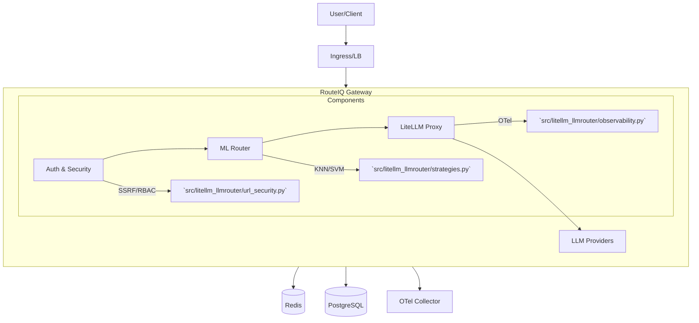

# Project State & Gaps

**Last Updated:** 2026-02-03

> **Attribution**:
> RouteIQ is built on top of upstream [LiteLLM](https://github.com/BerriAI/litellm) for proxy/API compatibility and [LLMRouter](https://github.com/ulab-uiuc/LLMRouter) for ML routing.

This document provides a consolidated view of RouteIQ Gateway's current architecture, value add, known gaps, and immediate roadmap.

## 1. Architecture Map

RouteIQ is structured as a wrapper around LiteLLM, injecting intelligence and enterprise features at key extension points.

### Key File Locations

| Component | Description | Key Files |
|-----------|-------------|-----------|
| **Entrypoint** | Server startup & config loading | [`src/litellm_llmrouter/startup.py`](../src/litellm_llmrouter/startup.py) |
| **Routing** | ML-based routing logic | [`src/litellm_llmrouter/strategies.py`](../src/litellm_llmrouter/strategies.py) |
| **Security** | SSRF & URL validation | [`src/litellm_llmrouter/url_security.py`](../src/litellm_llmrouter/url_security.py) |
| **MCP** | Model Context Protocol integration | [`src/litellm_llmrouter/mcp_gateway.py`](../src/litellm_llmrouter/mcp_gateway.py) |
| **A2A** | Agent-to-Agent protocol | [`src/litellm_llmrouter/a2a_gateway.py`](../src/litellm_llmrouter/a2a_gateway.py) |
| **HA / Leader Election** | Coordination & leader election | [`src/litellm_llmrouter/leader_election.py`](../src/litellm_llmrouter/leader_election.py) |
| **Plugin System** | Gateway plugin management | [`src/litellm_llmrouter/gateway/plugin_manager.py`](../src/litellm_llmrouter/gateway/plugin_manager.py) |
| **Telemetry** | Telemetry contracts & schemas | [`src/litellm_llmrouter/telemetry_contracts.py`](../src/litellm_llmrouter/telemetry_contracts.py) |

## 2. RouteIQ vs. Upstream LiteLLM

RouteIQ is a **superset** of LiteLLM. We aim to maintain 100% compatibility while adding "Moat Mode" features.

| Feature | LiteLLM (Upstream) | RouteIQ (This Project) |
|---------|--------------------|------------------------|
| **Proxy Core** | OpenAI-compatible API, 100+ Providers | ✅ **Inherited** (Direct wrapper) |
| **Routing** | Simple Shuffle, Least Busy, Latency | ✅ **Enhanced** (KNN, SVM, MLP strategies) |
| **Security** | Basic Auth | ✅ **Hardened** (SSRF Protection, Pickle Safety, Strict Defaults) |
| **Protocols** | Chat/Completions | ✅ **Expanded** (MCP, A2A, Skills) |
| **MLOps** | None | ✅ **Tooling** (Scripts for training & deploying routers) |
| **Observability**| Standard Logging | ✅ **Deep** (Routing decision telemetry, OTel contracts) |

## 3. Top Gaps & Known Issues

These are the highest priority technical debt and missing features as of the latest audit.

1.  **Quotas & Limits**: No granular quota management (e.g., "Team A gets $50/day").
2.  **RBAC**: Admin UI/API lacks fine-grained Role-Based Access Control (currently basic Admin/User).
3.  **Audit Logs**: Audit logs are ephemeral or local; need durable export to S3/Kafka for compliance.
4.  **Backpressure**: No mechanism to reject traffic when overloaded (risk of cascading failure).
5.  **Failover**: Database/Redis failover is handled by infrastructure, but app-level circuit breakers are basic.
6.  **CI Load Tests**: No automated load testing in CI pipeline to catch performance regressions.
7.  **MCP Tool Invocation**: Tool execution is currently flag-gated and lacks full OAuth delegation.

## 4. Phased Roadmap

### Now (Current Focus)
*   **Stability**: Fixing edge cases in ML routing and config syncing.
*   **Documentation**: Aligning docs with actual code state (this update).
*   **Validation**: Manual verification of HA and Security gates.

### Next (Q2 2026)
*   **Enterprise Hardening**: Implementing Backpressure and Load Shedding.
*   **Durable Auditing**: Shipping audit logs to S3.
*   **Automated MLOps**: Moving from scripts to a fully automated pipeline.

### Later (Q3 2026+)
*   **Advanced Scale**: Autoscaling based on custom metrics (KEDA).
*   **Multi-Region**: Global state synchronization.
*   **Management UI**: A dedicated React frontend for gateway administration.
